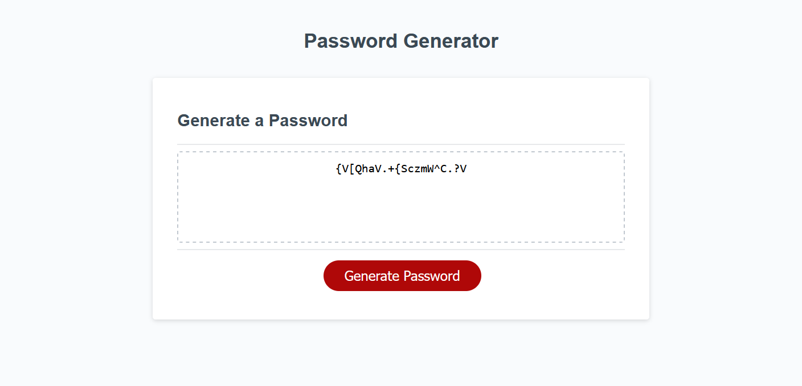

# password-generator
It generates a random password based on certain criteria.

## Usage
click the Generate Passord button to start the process of generating the password. It will prompt the user to introduce information to generate the password: length of password and type of charactoers to include. If information introduced by user not the appropriate to generate the password, it will  prompt again until apropriate information in introduced.

## Credits

Proyect completed on my own. Teaching websites have been used for help:
https://www.w3schools.com/js/js_loop_while.asp
Other pages of w3schools.com have been used to check the functioning of string method and other information.

## License

MIT License.

